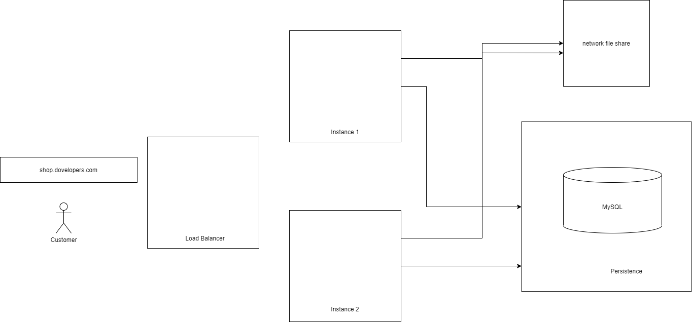
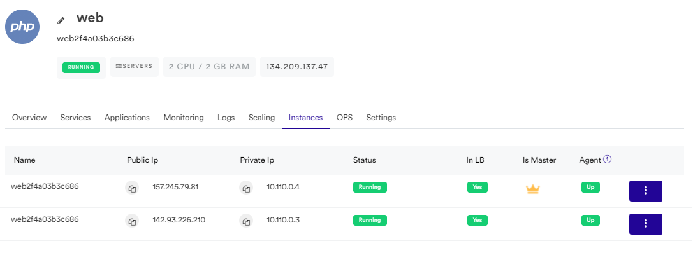

# Wordpress deployment in a scalable infrastructure

A scalable infrastructure is comprised by a web server with a load balancer and multiple instances that are provisioned in periods with high demand. In order to ensure persistence a database instance is required. Static files are stored in a network file system \(NFS\).



## Web Server

The web server has a load balancer and multiple instances that run the application. Cloud providers ensure the capabilities required to provision the infrastructure.

We will start the configuration by creating a Web Server with one instance. This will allow us to start with the minimal configuration required for the application and new instances will be added based on the snapshot of the master instance.



Creating the Web Server example

1. Select Programming Language: PHP

2. Select Web Server Type: nginix

3. Select Cloud: DigitalOcean

4. Select Location: Amsterdam

5. Select Operating System: Ubuntu 20.04

6. Select Plan: 2 vCPU /2 GB

Number of Servers: 1

Web Servers Name: web

Provisioning the resources will take around 10 minutes. When the operation is completed you should be able to see the load balancer and droplet in Digitalocean's dashboard.

## Persistence VMs

Create two VM that will handle persistence

* web-storage
* web-db

## Install Wordpress

## Network file system VM \(nfs\)

Install NFS

```bash
sudo apt-get install nfs-kernel-server
```

Create a directory

```text
sudo mkdir /nfsdata
```

Edit /etc/exports file

```php
sudo nano /etc/exports
```

Add the following content at the end of the file and save it

```text
/nfsdata 10.0.0.0/8(rw,sync,no_subtree_check,no_root_squash)
```

Export share

```text
sudo exportfs -rav
```

## Mount NFS

```php
sudo apt install nfs-common
```

```php
sudo showmount --exports <private_ip_of_nfs_server>
```

Edit /ect/fstab

```php
<privateip_of_nfs_server>:/nfsdata    /var/www    nfs    defaults,nfsvers=3,noatime    0    0
```

```php
sudo mount -a
```

Scaling the infrastructure to match our demand is a matter of increasing the number of instances.


## Wordpress config

```php
if($_SERVER['PHP_SELF']=="/index.php")
{
    define('WP_HOME','http://shop.dovelopers.com');
    define('WP_SITEURL','https://shop.dovelopers.com');
} else {
    define('WP_HOME','https://shop.dovelopers.com');
    define('WP_SITEURL','http://shop.dovelopers.com');
}
```

## Pricing

| Component | Monthly price |
| :--- | :--- |
| Load balancer | $10 |
| Instances  | $30 |
| Storage | $10 |
| Persistance | $20 |
| Bunnyshell | $49 |
| **Total** | $110 |

## Performance improvements

Enable opcache




